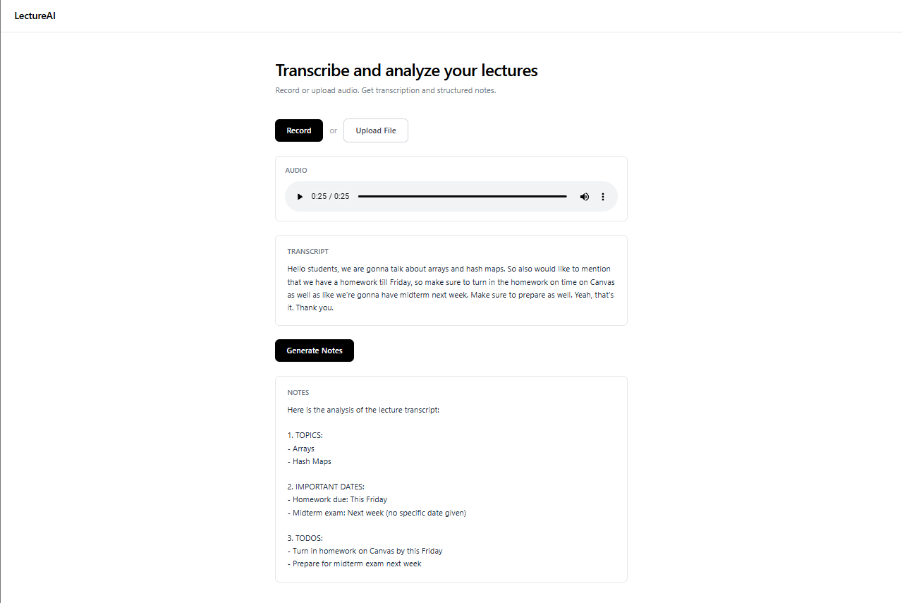

# LectureAI

Audio transcription and intelligent note extraction system powered by OpenAI Whisper and Llama 3.2.

**Current Version: v1.0.0**

---

## Overview

LectureAI processes lecture audio through a dual-AI pipeline. Whisper handles speech-to-text conversion while Llama 3.2 performs structured information extraction. The system identifies key topics, deadlines, and actionable items from unstructured audio input.

All processing runs locally. No data leaves your machine. Zero API costs.

---

## Architecture

```
Audio Input (Record / Upload)
        |
        v
  Whisper (244M params)
  Speech Recognition
        |
        v
    Transcript
        |
        v
  Llama 3.2 (3B params)
  Information Extraction
        |
        v
  Structured Notes
  - Topics
  - Important Dates
  - Action Items
```

---

## Screenshot



---

## Tech Stack

| Layer | Technology |
|-------|------------|
| Frontend | Next.js 14, TypeScript, Tailwind CSS |
| Backend | FastAPI, Python 3.11 |
| Speech Recognition | OpenAI Whisper (small, 244M parameters) |
| Text Analysis | Llama 3.2 (3B parameters via Ollama) |
| Audio Capture | Browser MediaRecorder API |

---

## Features

**Audio Input**
- Browser-based microphone recording
- File upload (MP3, WAV, M4A, WEBM)
- Audio playback for both recorded and uploaded files

**AI Processing**
- Real-time speech-to-text transcription
- Automated extraction of topics, dates, and action items
- Local inference with no external API dependencies

**Output**
- Plain text transcript
- Categorized notes: Topics, Important Dates, TODOs

---

## Getting Started

### Prerequisites

```
Python 3.8+
Node.js 18+
Ollama - https://ollama.com/download
```

### Backend

```bash
cd backend
python -m venv venv

# Windows
.\venv\Scripts\Activate

# macOS / Linux
source venv/bin/activate

pip install fastapi uvicorn python-multipart openai-whisper requests

ollama pull llama3.2

python main.py
```

Backend runs at `http://localhost:8000`

### Frontend

```bash
cd frontend
npm install
npm run dev
```

Frontend runs at `http://localhost:3000`

---

## API Reference

```
GET  /              Health check
GET  /health        Server status

POST /transcribe    Recorded audio  ->  transcript
POST /upload        Uploaded file   ->  transcript
POST /generate-notes   Transcript   ->  structured notes
```

---

## Project Structure

```
lecture-ai/
├── backend/
│   ├── main.py              # API endpoints and AI pipeline
│   ├── uploads/             # Temporary audio storage
│   └── venv/                # Python environment
│
├── frontend/
│   └── app/
│       ├── page.tsx         # Main page
│       ├── layout.tsx       # App layout
│       ├── globals.css      # Global styles
│       └── components/
│           └── Recorder.tsx # Recording and upload interface
│
├── assets/
│   └── screenshot.png       # UI screenshot
│
└── README.md
```

---

## Performance

| Operation | Time | Cost |
|-----------|------|------|
| Transcription | ~10s per minute of audio | $0 |
| Note generation | 5-15 seconds | $0 |
| Model loading | One-time at startup | - |

---

## Changelog

### v1.0.0
- Audio recording via browser microphone
- File upload with transcription
- Audio playback for recorded and uploaded files
- AI transcription using Whisper
- Structured note generation using Llama 3.2
- Clean minimal interface

---

## Roadmap

- [ ] Multi-language transcription
- [ ] PDF/Markdown export
- [ ] Batch file processing
- [ ] Note editing
- [ ] Cloud deployment

---

## License

MIT

---

## Author

[Rob Saidov]
GitHub: [@robsaidov]